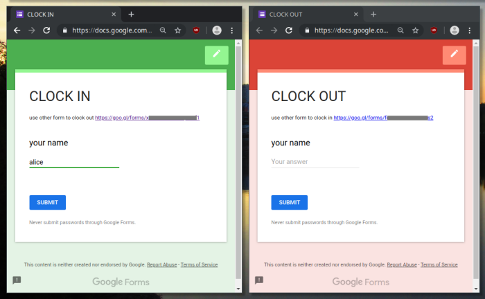

# Timeclock for hours volunteered at robotics

Students on Team 60 log the amount of time they work on our robot(and related projects) during build season.

This because the team requires(among other things) a certain number of hours logged for travel with the team to competitions.

I implemented a timeclock solution using google's forms, a spreadsheet, and apps script.

Both the mentors and students love it! Faster and simpler for the students--with up to date information provided for mentors.


## old system
- Sheets of paper in labeled folders for each student
- Writing down the times and duration each day
- Mentor manually summing each students total to verify travel elegibility

## what about existing time clock software?
- Complicated features we don't need like different hourly rates and overtime
- $$ most timeclock software is paid or freemium

Not well matched to our use case.

## new tech

Let's keep it simple. We can identify people by name(works wonderfully in a small group). So one google form to clock in, and another for clocking out.



The associated script for clocking in is straightforward to understand.

```
function onInSubmit() {
  var responses = FormApp.getActiveForm().getResponses();
  var last = responses[responses.length-1];
  var username = String(last.getItemResponses()[0].getResponse()).trim();

  Logger.log(username+" logging in");

  var ss = SpreadsheetApp.openById("15s5WXak4KLxC9Tb3TAZBhi30FBIl_eMxYUXq1Ip4pwY");
  Logger.log("got sheet:"+ss);
  var usersheet = ss.getSheetByName(username);
  if (!usersheet) {
    Logger.log("usersheet not exist");
    usersheet = timeclockutils.createUserSheet(ss, username);
  }
  timeclockutils.onClockIn(last.getTimestamp(), usersheet);
}
```


